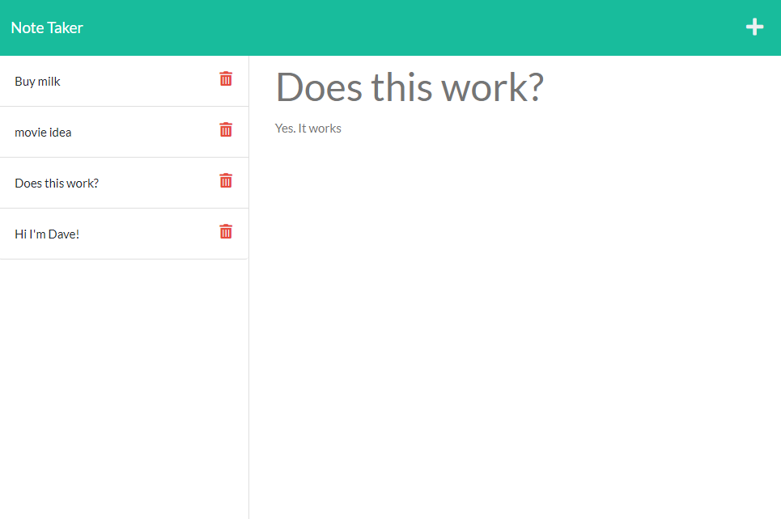

# NOTE TAKER

## Purpose

Build and deploy a notes app on Heroku.
Most of this app was prebuilt, but there was no backend that hooked up to any kind of database.
Well... technically it doesn't hook up to a database, just a flat JSON file. But still pretty neat.

## Description

This is just an app that allows the user to write notes and save them. You click add to add a new note, click on an old note to read it and click the little garbage can beside a note to delete it.

It runs on a node server using express JS and is deployed to Heroku.

## Screenshots

Here's an image of the app for reference.

## Working Link

[App here](https://note-taker-davebloisesquire.herokuapp.com/notes)
